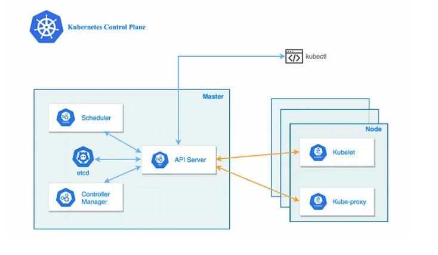

# 📘 Kubernetes Basics & Definitions

## What is Kubernetes?

**Kubernetes (K8s)** is an open-source container orchestration platform that automates the deployment, scaling, and management of containerized applications.

---

## 🔑 Key Features

- **Automatic Binpacking**: Places containers based on resource requirements and constraints.
- **Self-Healing**: Restarts failed containers and replaces them when needed.
- **Horizontal Scaling**: Automatically scales apps up or down based on load.
- **Service Discovery & Load Balancing**: Exposes containers using DNS or IP and distributes traffic.
- **Automated Rollouts & Rollbacks**: Gradually rolls out changes and rolls back if something goes wrong.
- **Secret & Configuration Management**: Manages sensitive information and configuration without rebuilding images.

---

## 🧱 Basic Concepts & Definitions


### 📊 Visual Diagram




### 1. **Node**
A single machine/server *worker machine*, either physical or virtual, that runs workloads (pods).

## ⚙️ Master Node vs Worker Node in Kubernetes

### 🧠 Master Node (aka Control Plane)
- Manages the **entire cluster**.
- Makes **decisions** (scheduling, scaling, health checks).
- **Does not run user apps directly**.

#### Main Components:
- `kube-apiserver`: API entry point for K8s to communicate with other services.
- `etcd`: Key-value database to store cluster data.
- `kube-scheduler`: Assigns pods to nodes.
- `controller-manager`: Maintains cluster state (controls and manage everything).

---

### 🧰 Worker Node
- Runs **application workloads**.
- Each node runs **pods** (which hold containers).

#### Main Components:
- `kubelet`: Talks to the master, ensures pod containers are running.
- `container runtime`: Runs containers (Docker, containerd, etc.).
- `kube-proxy/service proxy`: Manages networking for pods.

---

### 🔁 Summary Table

| Feature             | Master Node (Control Plane)      | Worker Node                 |
|---------------------|----------------------------------|-----------------------------|
| Purpose             | Manages the cluster              | Runs workloads (pods)       |
| Runs applications?  | ❌ No                            | ✅ Yes                      |
| Key Components      | API server, etcd, scheduler      | Kubelet, kube-proxy, runtime |
| Quantity            | Usually 1–3 (HA setup)           | Many, depends on scale      |


### 2. **Pod**
The smallest deployable unit in Kubernetes. A pod can run one or more containers that share storage and network.

🔹 Usually, **one container per pod** is the best practice.

🔁 Pods are **ephemeral** — if a pod dies, Kubernetes may replace it with a new one.

👉 Think of a pod as a **wrapper** around containers to manage them as a single unit.


### 3. **Cluster**
A group of nodes (machines/server) that run containerized applications.


### 4. **Container**
A lightweight, portable unit that includes everything needed to run a piece of software.

### 5. **Deployment**
A controller that manages replicas of pods and ensures the desired number of pods are running.

### 6. **Service**
A logical abstraction to expose a set of pods as a network service with a stable IP.

### 7. **Namespace**
A way to divide cluster resources between multiple users or environments or Groups (e.g., dev, test, prod).

### 8. **ConfigMap**
Used to store non-sensitive configuration data in key-value pairs.

### 9. **Secret**
Used to store sensitive data (e.g., passwords, tokens) securely in base64-encoded format.

### 10. **Volume**
Provides persistent or temporary storage for containers in a pod.

### 11. **Kubelet**
An agent that runs on each node and communicates with the control plane.

### 12. **Control Plane**
The brain of the Kubernetes cluster. It manages the cluster's overall state.

### 13. **API Server**
The entry point to the Kubernetes control plane. It validates and processes REST API requests.

### 14. **etcd**
A distributed key-value store used for storing all cluster configuration and state.

### 15. **Scheduler**
Assigns pods to suitable nodes based on resource availability and requirements.

### 16. **Controller Manager**
Runs controllers that regulate the state of the cluster (e.g., replicating pods, tracking node status).

---


# 🚀 Uses and Benefits of Kubernetes

## 🎯 What is Kubernetes Used For?

1. **Container Orchestration**
   - Manages deployment, scaling, and operation of containers (like Docker).

2. **Automated Deployment**
   - Automatically deploys applications based on configuration files (YAML).

3. **Scaling Applications**
   - Increases or decreases the number of running instances (pods) based on demand.

4. **Load Balancing**
   - Distributes incoming traffic evenly across multiple pods.

5. **Self-Healing**
   - Restarts crashed containers, replaces failed pods, and reschedules on healthy nodes.

6. **Rolling Updates and Rollbacks**
   - Gradually applies updates to the app without downtime and rolls back if needed.

7. **Service Discovery**
   - Assigns a stable IP and DNS name to services, making internal communication easy.

8. **Resource Management**
   - Efficiently manages CPU, memory, and storage resources across containers.

9. **Multi-cloud and Hybrid Deployments**
   - Runs across on-premises, public cloud, or hybrid environments.

10. **DevOps Automation**
    - Integrates with CI/CD pipelines to streamline development to production workflows.

---

## ✅ Benefits of Using Kubernetes

| Benefit                     | Description                                                                 |
|-----------------------------|-----------------------------------------------------------------------------|
| **Scalability**             | Automatically scales apps up or down based on demand.                      |
| **High Availability**       | Ensures apps are always running and can recover from failures.             |
| **Portability**             | Runs consistently on any cloud or on-prem environment.                     |
| **Efficiency**              | Better resource utilization through scheduling and binpacking.             |
| **Developer Productivity**  | Simplifies testing, deployment, and updates.                              |
| **Open-source & Community** | Large support ecosystem and vendor-neutral platform.                      |
| **Cost Optimization**       | Automates scaling and reduces resource waste.                              |
| **Security**                | Manages secrets and access controls for applications securely.             |
| **Infrastructure as Code**  | Uses YAML files to define the desired state of infrastructure and apps.    |
| **Rolling Updates**         | Updates applications without downtime or user impact.                      |

---


## 👨‍💻 Common `kubectl` Commands

```bash
kubectl get pods             # List all pods
kubectl get nodes            # List all nodes
kubectl apply -f file.yaml   # Create/update resources from a file
kubectl delete -f file.yaml  # Delete resources from a file
kubectl describe pod <name>  # Show details about a pod
kubectl logs <pod-name>      # Show logs of a pod

```
# 📦 Kubernetes Object Model

Kubernetes uses an **object-based model** to represent the desired state of the cluster.

---

## 🧱 What is a Kubernetes Object?

A **Kubernetes Object** is a persistent entity in the Kubernetes system.  
It represents a **record of intent** — what you want the system to do.

Each object has:
- **Spec**: What you want (e.g., 3 replicas of a pod)
- **Status**: What is actually happening now

---

## 🗂️ Key Parts of Every Object

| Field       | Description                                      |
|-------------|--------------------------------------------------|
| `apiVersion`| Which version of the K8s API you're using        |
| `kind`      | Type of object (Pod, Deployment, Service, etc.) |
| `metadata`  | Name, labels, namespace, annotations             |
| `spec`      | Desired state of the object                      |
| `status`    | Current state of the object (updated by K8s)     |

---

## 📘 Common Kubernetes Objects

| Object      | Purpose                                      |
|-------------|----------------------------------------------|
| `Pod`       | Runs one or more containers                  |
| `Service`   | Exposes pods to network traffic              |
| `Deployment`| Manages replicas of pods, handles updates    |
| `ReplicaSet`| Ensures a set number of pods are running     |
| `StatefulSet`| Like Deployment but with stable IDs/storage |
| `DaemonSet` | Runs a pod on every node                     |
| `Job`       | Runs a one-time task                         |
| `CronJob`   | Runs tasks on a schedule                     |
| `ConfigMap` | Stores non-sensitive configuration data      |
| `Secret`    | Stores sensitive data securely               |
| `Namespace` | Isolates objects in the cluster              |
| `Ingress`   | Manages external HTTP(S) access              |
| `Volume`    | Provides persistent or shared storage        |

---

## 🧠 Summary

- Kubernetes objects declare the **desired state** of your system.
- You define objects using **YAML or JSON** files.
- The **Kubernetes Control Plane** works to maintain this state automatically.


# 📡 Kubernetes API Resource Types

Kubernetes exposes **objects** through an **HTTP REST API**.  
Each **object** is a **resource type** you can create, read, update, or delete.

---

## 📁 API Resource vs Kind

- **Kind**: The type of object you define in your YAML (`kind: Pod`, `kind: Deployment`, etc.)
- **Resource Type**: The plural name used in the API (e.g., `pods`, `deployments`)

---

## 🧾 Common API Resource Types

| Kind         | Resource Type (Plural) | Description                            |
|--------------|-------------------------|----------------------------------------|
| `Pod`        | `pods`                  | Run containers                         |
| `Service`    | `services`              | Expose pods as network service         |
| `Deployment` | `deployments`           | Manage stateless pods                  |
| `ReplicaSet` | `replicasets`           | Ensure desired number of pods          |
| `StatefulSet`| `statefulsets`          | Manage stateful pods                   |
| `DaemonSet`  | `daemonsets`            | Run a pod on all nodes                 |
| `Job`        | `jobs`                  | Run a one-time task                    |
| `CronJob`    | `cronjobs`              | Schedule recurring jobs                |
| `Namespace`  | `namespaces`            | Divide cluster into logical sections   |
| `Node`       | `nodes`                 | Cluster worker machines                |
| `ConfigMap`  | `configmaps`            | Store non-secret config data           |
| `Secret`     | `secrets`               | Store sensitive config data            |
| `Ingress`    | `ingresses`             | Manage external access to services     |
| `PersistentVolume` | `persistentvolumes` | Provisioned storage unit             |
| `PersistentVolumeClaim` | `persistentvolumeclaims` | Request storage            |

---

## 🔧 How to View API Resources

```bash
kubectl api-resources
```

# 📦 Kubernetes Pod: Concept & Use Cases

## ✅ What is a Pod?

A **Pod** is the **smallest deployable unit** in Kubernetes.

- Represents **a single instance** of a running process.
- Usually contains **one container**, but can contain **multiple containers** that share:
  - Network (IP, port)
  - Storage (volumes)
  - Configuration (environment variables)

---

## 🧠 Key Concepts

| Feature             | Description                                                |
|---------------------|------------------------------------------------------------|
| **Single IP Address**| All containers in a pod share the same IP                 |
| **Shared Volumes**   | Used for communication between containers                 |
| **Tightly Coupled**  | Multiple containers in a pod work as one unit             |
| **Ephemeral**        | Pods are temporary; they can be replaced when needed      |
| **Managed by Controllers** | E.g., Deployments or ReplicaSets for stability     |

---

## 💡 Use Cases of Pods

| Use Case                             | Description                                                                 |
|--------------------------------------|-----------------------------------------------------------------------------|
| **Single Container Pod**             | Typical use — one app per pod (e.g., Nginx server)                          |
| **Sidecar Pattern**                  | Add helper containers (e.g., logging, monitoring) to the main app container |
| **Adapter Pattern**                  | Add a translator container for compatibility (e.g., data format conversion) |
| **Ambassador Pattern**               | Add a proxy container to handle external communication                      |
| **Batch Jobs**                       | Run one-off tasks that complete and exit                                    |
| **Daemon Pods**                      | Pods that run on every node for monitoring or logging (via DaemonSet)       |

---

## 🔁 Pod Lifecycle

1. **Pending** – Pod is accepted but not running yet.
2. **Running** – All containers are up and running.
3. **Succeeded** – Containers completed successfully.
4. **Failed** – At least one container failed.
5. **Unknown** – Status can't be obtained.

---

## 🧪 Pod Example (YAML)

```yaml
apiVersion: v1
kind: Pod
metadata:
  name: my-app-pod
spec:
  containers:
    - name: my-container
      image: nginx
```

# 🧰 Multi-Container Pods in Kubernetes

## 🧾 What is a Multi-Container Pod?

A **multi-container pod** has **two or more containers** running in a single pod.

- All containers **share the same network namespace**, IP, and storage volumes.
- Containers work **tightly together** and communicate via `localhost`.

---

## 🤝 Why Use Multi-Container Pods?

Use when containers need to:
- **Collaborate closely** within the same lifecycle.
- Share **logs, data, or configuration**.
- Be **deployed and scheduled together**.

---

## 🔧 Common Patterns

| Pattern            | Description                                                                 |
|--------------------|-----------------------------------------------------------------------------|
| **Sidecar**         | Helper container enhances the main app (e.g., log shipper, monitoring agent) |
| **Ambassador**      | Proxy container connects the main app to an external service                |
| **Adapter**         | Translates data formats or protocols between systems                        |

---

## 🧪 Example: Pod with 2 Containers

```yaml
apiVersion: v1
kind: Pod
metadata:
  name: multi-container-pod
spec:
  containers:
    - name: main-app
      image: nginx
    - name: log-agent
      image: busybox
      command: ["sh", "-c", "while true; do echo Logging...; sleep 5; done"]
```

# 🚀 Deployment vs Pod Management in Kubernetes

## 🧾 What is a Pod?

- A **Pod** is the **basic unit** that runs containers.
- Created directly using `kubectl` or YAML.
- **Not ideal for production** because:
  - If a pod crashes, it won’t restart automatically.
  - No versioning or rolling updates.

---

## 🛠️ What is a Deployment?

A **Deployment** is a **higher-level object** that manages pods **automatically**.

- Ensures **desired number of replicas** are running.
- Handles **updates, rollbacks**, and **self-healing**.
- Ideal for **production environments**.

---

## 🔁 Key Differences

| Feature                 | Pod                            | Deployment                            |
|------------------------|---------------------------------|----------------------------------------|
| Purpose                | Run containers manually         | Manage pods declaratively              |
| Restart on failure     | ❌ No automatic restart         | ✅ Yes, auto-reschedules failed pods    |
| Replica management     | ❌ Manual                       | ✅ Automatic with ReplicaSet            |
| Rolling updates        | ❌ Not supported                | ✅ Supported                            |
| Rollbacks              | ❌ Not possible                 | ✅ Easy rollback to previous version    |
| Scaling                | ❌ Manual                       | ✅ Automatic (`kubectl scale`)          |
| Best for               | Testing, learning               | Production, real-world deployments     |

---

## 🧪 Example: Deployment YAML

```yaml
apiVersion: apps/v1
kind: Deployment
metadata:
  name: nginx-deployment
spec:
  replicas: 3
  selector:
    matchLabels:
      app: nginx
  template:
    metadata:
      labels:
        app: nginx
    spec:
      containers:
        - name: nginx
          image: nginx:1.25
```

# 📈 Scaling Applications in Kubernetes

**Scaling** means increasing or decreasing the number of pod replicas for better performance or efficiency.

---

## 🔁 Types of Scaling

| Type             | Description                                |
|------------------|--------------------------------------------|
| **Manual Scaling** | You set the number of replicas manually     |
| **Auto Scaling**   | Kubernetes adjusts replicas automatically  |

---

## ⚙️ Manual Scaling

### 🧪 Command:

```bash
kubectl scale deployment <deployment-name> --replicas=<number>

kubectl scale deployment my-nginx-deployment --replicas=5

```
## ⚙️ Horizontal Pod Autoscaler (HPA)

HPA automatically scales pods based on CPU/memory usage.

### Create HPA-
```bash
kubectl autoscale deployment my-nginx-deployment --cpu-percent=70 --min=2 --max=10
```
### Check HPA-

```bash
kubectl get hpa
```
## 🧠 Best Practices
Use manual scaling for testing or predictable workloads.

Use HPA for dynamic workloads (e.g., traffic spikes).

Make sure your application exposes resource requests/limits for autoscaling to work.


# 📦 Kubernetes Workload Controllers

Kubernetes provides different controllers to manage pod lifecycles and scaling.

---

## 🔁 ReplicaSet

- Ensures a **specified number of pod replicas** are always running.
- Replaces pods if they crash or are deleted.

### ✅ Use Case:
- Maintain **high availability** by ensuring N identical pod replicas.

### ❌ Limitation:
- Not used directly for updates. Use **Deployment** instead.

---

## 🚀 Deployment

- **Manages ReplicaSets** and provides features like:
  - Rolling updates
  - Rollbacks
  - History tracking

### ✅ Use Case:
- Standard way to deploy and manage **stateless** applications.

### 🔄 Example Flow:
1. Deployment creates ReplicaSet
2. ReplicaSet manages Pods
3. New image = new ReplicaSet → rolling update

---

## 🧱 StatefulSet

- Designed for **stateful applications** (e.g., databases).
- Provides:
  - Stable pod names (`pod-0`, `pod-1`, ...)
  - Stable storage (PersistentVolumes)
  - Ordered deployment and scaling

### ✅ Use Case:
- Applications that need:
  - Persistent identity
  - Ordered startup/shutdown
  - Stable storage (e.g., MySQL, Cassandra)

---

## 🔍 Comparison Table

| Feature            | ReplicaSet       | Deployment       | StatefulSet        |
|--------------------|------------------|------------------|--------------------|
| Pod Management     | ✔ Yes            | ✔ Yes            | ✔ Yes              |
| Updates Support    | ❌ No             | ✔ Rolling update | ✔ Ordered update   |
| Unique Pod Names   | ❌ No             | ❌ No             | ✔ Yes (`pod-0`, etc.) |
| Persistent Storage | ❌ No             | ❌ No             | ✔ Yes              |
| Use Case           | Basic scaling     | Stateless apps   | Stateful apps      |

---

## 🧠 Summary

- **ReplicaSet**: Ensures desired pod count.
- **Deployment**: Manages ReplicaSet with rolling updates.
- **StatefulSet**: Manages stateful apps with stable identities and volumes.


# 🔄 Rollout and Rollback Strategies in Kubernetes

Kubernetes supports **safe and controlled updates** to applications using rollouts,  
and allows **quick recovery** using rollbacks.

---

## 🚀 Rollout Strategy

A **rollout** updates your application pods to a new version.

### 🎯 Default: `RollingUpdate`

- Updates pods **one at a time** to prevent downtime.
- Ensures **zero-downtime deployments**.

```yaml
strategy:
  type: RollingUpdate
  rollingUpdate:
    maxSurge: 1          # Extra pod allowed during update
    maxUnavailable: 1    # Max pods that can be unavailable
```

## ❌ Alternative: Recreate
Stops all old pods, then starts new ones.

May cause downtime.
To trigger-
```yml

kubectl set image deployment/my-app my-container=my-image:v2

```

# 🌐 Kubernetes Services

**Services** in Kubernetes expose a set of Pods as a network service,  
allowing communication within the cluster or with the outside world.

---

## 🚦 1. Types of Services

| Type            | Access Scope           | Description                                         |
|------------------|------------------------|-----------------------------------------------------|
| **ClusterIP**     | Internal-only          | Default type. Exposes service **inside the cluster** |
| **NodePort**      | External via Node IP   | Opens a **port on each node** for external access   |
| **LoadBalancer**  | External via LB        | Provisions **external load balancer** (cloud only)  |
| **ExternalName**  | DNS redirect           | Maps service to **external DNS name**               |

---

### ✅ ClusterIP Example (default)

```yaml
spec:
  type: ClusterIP
  ports:
    - port: 80
```

### 🌍 NodePort Example

```yaml
spec:
  type: NodePort
  ports:
    - port: 80
      nodePort: 30007
```

### ☁️ LoadBalancer Example

```yaml
spec:
  type: LoadBalancer
  ports:
    - port: 80
```

## 🧭 2. Service Discovery Mechanism

Kubernetes provides built-in **service discovery** using the following methods:

---

### 🔹 Environment Variables

- Kubernetes injects environment variables into each Pod.
- Example vars:  
  - `SERVICE_HOST`  
  - `SERVICE_PORT`  
- These allow containers to discover and connect to services inside the cluster.

---

### 🔹 DNS (CoreDNS)

- **CoreDNS** is the default DNS service in Kubernetes.
- Every service is assigned a DNS name automatically.

#### 🧩 DNS Format:

```pgaql
<service-name>.<namespace>.svc.cluster.local

```
## 🚀 3. Exposing Applications

How to expose your application in different scenarios:

| 🎯 Goal                        | ✅ Recommended Approach                 |
|-------------------------------|----------------------------------------|
| Internal pod-to-pod access    | Use `ClusterIP`                        |
| Access from browser (local)   | Use `NodePort` or `kubectl port-forward` |
| Public internet access        | Use `LoadBalancer` (or `Ingress`)      |
| Use domain name               | Use `Ingress + DNS records`            |

## 🌐 4. DNS in Kubernetes

- Kubernetes uses **CoreDNS** to manage internal DNS.
- Every service automatically gets a DNS name.

### 🧩 DNS Format:

```pgsql
<service-name>.<namespace>.svc.cluster.local

```


- Pods use this DNS to communicate with services.
- No need to hard-code IP addresses — Kubernetes handles service discovery dynamically.

# 🔧 ConfigMaps & Secrets in Kubernetes

Kubernetes provides **ConfigMaps** and **Secrets** to manage configuration and sensitive data separately from application code.


## 📊 ConfigMap vs Secret

| Feature       | ConfigMap         | Secret               |
|---------------|-------------------|-----------------------|
| Purpose       | Store config data | Store sensitive data |
| Encoded       | No                | Yes (Base64)         |
| Use as env    | ✔ Yes             | ✔ Yes                |
| Use as volume | ✔ Yes             | ✔ Yes                |


---

## 1. 📦 Application Configuration in Kubernetes

- Applications often need config values (like URLs, ports, etc.).
- Kubernetes stores this **externally** from the container using:
  - **ConfigMaps** for general config
  - **Secrets** for sensitive data (like passwords, API keys)

---

## 2. 🛠️ Creating and Using ConfigMaps

### ✅ Create ConfigMap from literal values

```bash
kubectl create configmap app-config --from-literal=APP_MODE=production
```

### ✅ Create ConfigMap from a file

```bash
kubectl create configmap app-config --from-file=config.txt
```

### ✅ Use ConfigMap in a Pod (as env var)

```yaml

env:
  - name: APP_MODE
    valueFrom:
      configMapKeyRef:
        name: app-config
        key: APP_MODE
```


### ✅  Use ConfigMap as a Volume

```yaml

volumes:
  - name: config-volume
    configMap:
      name: app-config

volumeMounts:
  - name: config-volume
    mountPath: /etc/config

```

## 3. 🔐 Managing Sensitive Information with Secrets

Secrets store sensitive data securely in Base64.

Used for credentials, tokens, keys, etc.

```bash

kubectl create secret generic db-secret --from-literal=DB_PASS=admin123
```
## 4. 📁 Mounting Configurations into Pods

You can mount both **ConfigMaps** and **Secrets** into Pods using two main methods:

| Method       | Purpose                            |
|--------------|-------------------------------------|
| Environment  | For small or simple configuration values |
| Volumes      | For files, configs, or certificates     |

- **Environment variables** are easier for small values.
- **Volumes** are preferred when applications expect files or when storing structured config data.

# 🔄 CI/CD for Kubernetes (Expanded)

---

## 1. Kubernetes Manifests in Source Control

- **Why store manifests in Git?**  
  - **Version history**: track when and why changes happened  
  - **Collaboration**: use pull requests for review and approval  
  - **Audit & compliance**: easily see who changed what  

- **What to commit**  
  - Resource definitions: Deployments, Services, ConfigMaps, Secrets (encrypted)  
  - Namespace and RBAC manifests  
  - Ingress rules, NetworkPolicies, StorageClasses  

- **Managing complexity**  
  - **Kustomize**: overlay base manifests with environment‑specific patches  
  - **Helm**: templatize manifests and supply values per environment  
  - **Directory structure** example:  
    ```
    ├── base/
    │   ├── deployment.yaml
    │   └── service.yaml
    ├── overlays/
    │   ├── dev/
    │   └── prod/
    ```

---

## 2. `kubectl` and CI/CD Pipelines

- **Integrating `kubectl`**  
  - Use `kubectl apply -f path/to/manifests` to create/update resources  
  - Use `kubectl diff -f` (v1.18+) to preview changes  

- **CI stages**  
  1. **Lint & Validate**  
     - `kubeval`, `kubectl apply --dry-run=client`  
  2. **Build & Test**  
     - Build container image, run unit/integration tests  
  3. **Push**  
     - Push to registry (e.g., Docker Hub, ECR, GCR)  

- **CD stages**  
  1. **Deploy**  
     - `kubectl apply`, or `helm upgrade --install`  
  2. **Smoke tests**  
     - Hit health endpoints, verify rollout status  
  3. **Notify/Rollback**  
     - On failure, run `kubectl rollout undo deployment/<name>`

- **Popular CI/CD tools**  
  - **GitHub Actions**: workflows in `.github/workflows/`  
  - **GitLab CI**: `.gitlab-ci.yml` with Kubernetes executor  
  - **Jenkins**: scripted/pipeline jobs with `kubectl` plugins  
  - **Argo CD / Flux**: GitOps—cluster auto‑sync with Git repo  

---

## 3. Deployment Strategies

### 🔵 Blue/Green

- **How it works**  
  1. Deploy v2 alongside v1 in separate namespaces or labels (`blue`, `green`)  
  2. Switch service selector or load‑balancer target from blue → green  
  3. Keep v1 intact until v2 is verified  

- **Pros & Cons**  
  - ✅ Instant rollback: switch back to blue  
  - ✅ Zero‑downtime if configured correctly  
  - ❌ Requires double capacity (two environments)  

### 🟡 Canary

- **How it works**  
  1. Deploy a small subset of pods running v2 (e.g., 10%)  
  2. Route a fraction of traffic to canary pods via weighted Service or Ingress  
  3. Monitor metrics (error rate, latency)  
  4. Gradually increase percentage until 100%  

- **Pros & Cons**  
  - ✅ Lower resource overhead  
  - ✅ Gradual risk mitigation  
  - ❌ More complex routing and monitoring setup  

---

## 4. Environment Management

- **Namespaces vs. Separate Clusters**  
  - **Namespaces**: logical isolation within one cluster (good for dev/test)  
  - **Clusters**: physical separation (stronger isolation for prod)  

- **Config variation**  
  - **Helm values files**: `values-dev.yaml`, `values-prod.yaml`  
  - **Kustomize overlays**: patch `replicas`, `imageTag`, resource limits  

- **Secrets & ConfigMaps per environment**  
  - Store dev/test credentials separately from prod  
  - Use sealed‑secrets or Sops for encrypting prod secrets in Git  

- **Access control**  
  - RBAC roles bound to namespaces or clusters  
  - Limit who can deploy to prod vs. dev  

- **Automating promotion**  
  - GitOps: merge to `main` branch triggers prod deploy  
  - Pull‑request-based promotion between branches/environments  

---


# Helm Basics

## Helm Architecture and Components

- **Helm (Client)**: Helm is the package manager for Kubernetes, and `helm` is its command-line client. It simplifies installing and managing Kubernetes applications by using *charts* (bundled resource definitions).  
- **Chart**: A *chart* is a Helm package containing all the Kubernetes manifests and metadata needed to deploy an application. You can think of a chart like a container image or OS package (e.g. Homebrew formula) that bundles templates and default values.  
- **Release**: A *release* is a specific deployment of a chart in a cluster. Each time you run `helm install`, Helm creates a new release with a unique name. For example, installing a MySQL chart three times under different release names results in three separate releases. Each release tracks its own revision history.  
- **Chart.yaml**: This required file (in each chart directory) contains metadata about the chart (name, version, etc.). It includes fields like `name`, `version`, `apiVersion`, `appVersion`, `maintainers`, etc.  
- **values.yaml**: Each chart includes a `values.yaml` file that defines the default configuration values (parameters) for the chart. These values are used to render the templates, but can be overridden by the user at install/upgrade time.  
- **templates/**: Charts have a `templates/` directory containing Kubernetes manifest *templates* (YAML files with Go templating). When you install a chart, Helm combines these templates with the values (from `values.yaml` or user overrides) to generate the final Kubernetes resource files.  
- **Library Charts**: A *library chart* is a special chart type introduced in Helm 3 that contains reusable template code (helpers or primitives) for other charts to import. Library charts are not installable on their own; they exist only to share common snippets across charts (helping avoid duplication).  
- **Tiller (Helm v2 only)**: In Helm 2, *Tiller* was the in-cluster server component that managed releases. Tiller has been **removed** in Helm 3. Helm 3 now runs entirely client-side, using the same Kubernetes RBAC credentials as `kubectl`. This simplifies security (no extra server in the cluster).

## Helm Chart and Template Structure

A Helm chart is organized as a directory with a fixed layout. For example:

```
mychart/
├─ Chart.yaml          # REQUIRED: Chart metadata (name, version, etc.)
├─ values.yaml         # REQUIRED: Default values for this chart
├─ charts/             # OPTIONAL: Dependent charts (used as subcharts)
├─ templates/          # REQUIRED: Templates for Kubernetes resources
│  ├─ _helpers.tpl     # Convention: reusable template helpers/partials
│  ├─ NOTES.txt        # OPTIONAL: Post-installation notes
│  └─ <other .yaml>    # Template files (services, deployments, etc.)
├─ crds/               # OPTIONAL: CustomResourceDefinitions to be installed
├─ values.schema.json  # OPTIONAL: JSON Schema to validate values.yaml
├─ README.md           # OPTIONAL: Human-readable chart documentation
└─ LICENSE             # OPTIONAL: License file
```

## Helm Repositories

A *Helm chart repository* is simply a web-accessible HTTP server (or storage bucket) that hosts packaged charts and an `index.yaml` file. The `index.yaml` serves as an index of all charts in the repo, listing each chart’s name, version, and metadata.

Helm provides commands to manage chart repositories: adding, listing, updating, and removing them. Some key commands include:

- `helm repo add <name> <url>`: Add a chart repository.
- `helm repo list`: List all configured repositories and their URLs.
- `helm repo update`: Fetch the latest `index.yaml` from all registered repos.
- `helm search repo <keyword>`: Search for charts in the locally configured repos.
- `helm repo remove <name>`: Remove a repository by name.

## Installing Applications with Helm

To deploy (install) an application with Helm, use the `helm install` command:

```bash
helm install mysite bitnami/nginx
```

By default, the chart’s templates are rendered with the default values in `values.yaml`. You can customize the deployment by overriding values:

- **Override via CLI**:
  ```bash
  helm install mydb bitnami/mysql --set mysqlRootPassword=secret,service.type=LoadBalancer
  ```
- **Override via file**:
  ```bash
  helm install mydb -f custom-values.yaml bitnami/mysql
  ```

Other useful commands:

- `helm upgrade`: Upgrade an existing release.
- `helm rollback`: Roll back a release to a previous revision.
- `helm uninstall`: Uninstall a release from the cluster.


# Kubernetes Monitoring Basics

## Resource Monitoring Approaches

**Definition**: Resource monitoring in Kubernetes involves tracking the usage of system resources (CPU, memory, disk, network) by nodes, pods, and containers. This helps identify performance bottlenecks, over-provisioning, or potential failures.

### Key Approaches:
- **Node-level Monitoring**: Collect metrics on node CPU, memory, disk usage (e.g., via cAdvisor, kubelet).
- **Pod/Container Monitoring**: Track resource usage per container using metrics server or Prometheus.
- **Cluster-wide Monitoring**: Aggregate metrics from all nodes and pods for a global view.
- **Custom Metrics**: Define application-specific metrics exposed via endpoints (e.g., `/metrics`).

## Health Probes

**Definition**: Kubernetes uses health probes to check the status of containers. Probes help determine when to restart or stop routing traffic to a pod.

### Types of Probes:
- **Liveness Probe**: Checks if the container is still running. If it fails, Kubernetes restarts the container.
- **Readiness Probe**: Checks if the container is ready to accept traffic. If it fails, the container is removed from service endpoints.
- **Startup Probe**: Used to give slow-starting containers time to initialize before liveness probes start.

### Example (HTTP):
```yaml
livenessProbe:
  httpGet:
    path: /healthz
    port: 8080
  initialDelaySeconds: 3
  periodSeconds: 10
```

## Basic Logging Practices

**Definition**: Logging in Kubernetes involves capturing application logs for debugging and observability.

### Practices:
- **stdout/stderr Logging**: Apps should log to stdout and stderr; kubelet collects these logs.
- **Centralized Logging**: Use tools like Fluentd, Logstash, or Loki to collect and store logs in systems like Elasticsearch or Grafana.
- **Log Rotation**: Implement log rotation to avoid disk overuse.
- **Structured Logging**: Use JSON or key-value format for easier parsing.

## Monitoring Tools Overview

**Definition**: Various tools provide monitoring, visualization, and alerting capabilities for Kubernetes clusters.

### Popular Tools:
- **Prometheus**: Time-series metrics collection and alerting. Widely used with Kubernetes.
- **Grafana**: Dashboard and visualization tool often used with Prometheus.
- **Metrics Server**: Lightweight resource metrics collection for Kubernetes autoscaling.
- **Kube-state-metrics**: Exposes cluster state metrics (e.g., deployments, pods).
- **ELK Stack**: Elasticsearch, Logstash, Kibana for log aggregation and analysis.
- **Loki**: Lightweight log aggregation system by Grafana Labs.
- **Jaeger**: Distributed tracing system for tracking requests across microservices.
